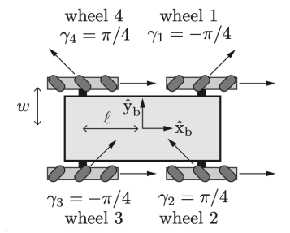
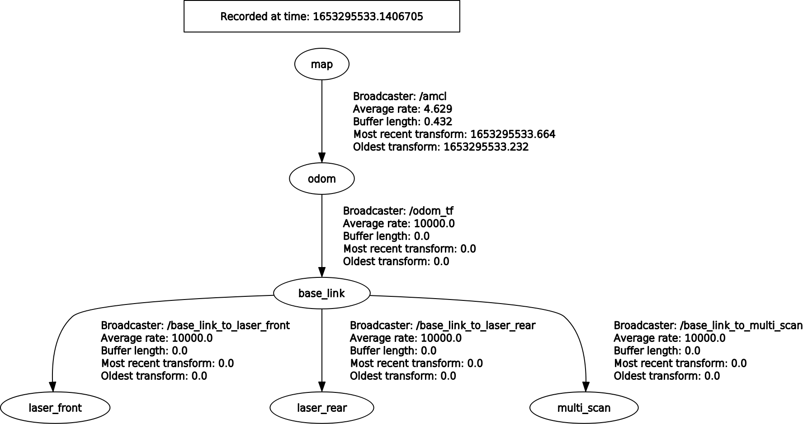

# Omnidirectional Robot Localization and Mapping

This repository contains the second laboratory project for the [Robotics course 2021/2022](https://www4.ceda.polimi.it/manifesti/manifesti/controller/ManifestoPublic.do?EVN_DETTAGLIO_RIGA_MANIFESTO=evento&aa=2021&k_cf=225&k_corso_la=481&k_indir=T2A&codDescr=089013&lang=IT&semestre=2&idGruppo=4336&idRiga=271084) of the Polytechnic University of Milan.

The project is implemented in ROS, an open-source robotics middleware suit.

## Requirements

- C++
- Python 3
- OpenCV (python library)
- Ubuntu 18.04 (20.04 is okay too)
- [ROS Melodic (Noetic is okay too)](http://wiki.ros.org/melodic/Installation/Ubuntu)
- [ROS gmapping](http://wiki.ros.org/gmapping)
- [ROS map server](http://wiki.ros.org/map_server)
- [ROS amcl](http://wiki.ros.org/amcl)

## Project structure 

The project contains one package (`omnirobot_loc_and_mapping`), which root folder is the [/src/omnirobot_loc_and_mapping/](src/omnirobot_loc_and_mapping/) folder. We will consider this as root folder.

The source files are under the [src/](src/omnirobot_loc_and_mapping/src/) folder:
- `odom_tf.cpp`: it deals with the need of having the odometry published as a tf.

The Python scripts are under [scripts](src/omnirobot_loc_and_mapping/scripts/) folder:
- `map_smoother.py`: it computes some post-processing techniques to the map, in order to have it smoother.
- `trajectory_saver.py`: it is in charge of receiving the current positions of the robot, given from amcl_pose, in order to draw the trajectory on the map and save it.
- `trajectory_drawer.py`: it is in charge of drawing the trajectory on rviz.

The [launch files](src/omnirobot_loc_and_mapping/launch/) contain all the files to start the nodes for mapping, localization, laser merge and transformation. It also contains the xml files for `gmapping` and `amcl`, where it is possible to tune all the parameters.

Under [maps](src/omnirobot_loc_and_mapping/maps/) it is possible to find the generated map (gmapping) and the maps with trajectories (amcl).

Finally are defined `CMakeLists.txt` and `package.xml` for compilation purposes.

Moreover, `src/ira_laser_tools` is a third-party package that we included in the launch files to merge the two laser scans of the robot. 

Outside the main package, under [/previously_generated_maps/](previously_generated_maps/) you can find the maps and trajectories generated by us, and under [/bags/](bags/) you can find the bags we will refer to below.

## Getting Started

To set up the workspace, let's clone the repository where you prefer and change directory:
```
git clone https://github.com/davide-giacomini/omnidirectional-robot-localization-and-mapping.git
cd omnidirectional-robot-localization-and-mapping/
```

In order for the laser merger to work, you have to pull the package as submodule:
```
git submodule init
git submodule update
```

Build the environment with catkin:
```
catkin_make
```

Add ROS worspace to your system. Add the end of the `bashrc` file the path to the `devel/setup.bash` file:
```
echo "source </path/to/project/folder/>omnidirectional-robot-localization-and-mapping/devel/setup.bash" >> ~/.bashrc
source ~/.bashrc
```

Warning: In case you have already defined in your `bashrc` file a path for another workspace, comment or delete it. Each machine must have only one workspace defined.

Warning: Remember to give executable rights to the scripts in python in order to run them as nodes (otherwise, the launch files will throw an error): `chmod +x <script_name>.py`.

In this project you can choose either to perform the mapping or the localization of the environment. For these tasks there are two launch files (one for localization and one for mapping), introduced [`Project Structure`](https://github.com/davide-giacomini/omnidirectional-robot-localization-and-mapping#project-structure), and three bag files.

During localization, it is possible to save the trajectory of the robot using a service call.

### Performing mapping

To start the mapping is necessary to launch [mapping_launcher.launch](src/omnirobot_loc_and_mapping/launch/mapping_launcher.launch):
```
roslaunch omnirobot_loc_and_mapping mapping_launcher.launch
```

We used `bag 2` for mapping because, after some experiments, it seemed to be the one that gave the best quality map. Just notice that also `bag 1` gave a good quality map, instead `bag 3` did not have a good mapping capability.
Then, you can start one of the tree bags, as you want. 
```
rosbag play --clock <bag_name>.bag
```

Remember the `--clock` argument to let the node synchronize with the bag's clock.

With `rviz` you can see the creation of the map in real-time.

When the bag ends, it is possible to save the map using the `map_saver` service of the package [map server](http://wiki.ros.org/map_server#map_saver):
```
rosrun map_server map_saver -f map
```
Remember that, to use the generated map for localization, you must save the `.pgm` file and the `.yaml` file generated under the folder [maps/](src/omnirobot_loc_and_mapping/maps/).

We also used a script to process the image of the map and correct some minor imprecisions that can be easily detected. It can be run as a ros node:
```
rosrun omnirobot_loc_and_mapping map_smoother.py
```

It processes the map and publishes the smoothed map on the topic `/map_smoothed`. To save it, the map server can be run again, this time specifying to read from topic `map_smoothed`:
```
rosrun map_server map_saver -f map map:=/map_smoothed
``` 

We have previously computed both the map without running the script ([raw_map.pgm](previously_generated_maps/raw_map.pgm)) and the map running it ([map.pgm](previously_generated_maps/map.pgm)). We used `bag 2` to generate it. Notice that the `amcl` node requires the file of the map named `map.pgm` to load the static map correctly. When using `map_saver`, the map must be named `map` thus overwriting the one already present (the previous bash scripts already do it). This is the only way `amcl` can use it without changing the code inside [`localization_launcher.launch`](src/omnirobot_loc_and_mapping/launch/localization_launcher.launch)). If you wish to use our generated map for localization without generating one yourselves, just move our map *and the `.yaml` file* under the folder [maps/](src/omnirobot_loc_and_mapping/maps/).

### Performing localization

To start the localization is necessary to launch [localization_launcher.launch](src/omnirobot_loc_and_mapping/launch/localization_launcher.launch):
```
roslaunch omnirobot_loc_and_mapping localization_launcher.launch
```

Then, you can start one of the tree bags, as you want (we used `bag 1 and bag 3` for localization, for the reasons described above):
```
rosbag play --clock <bag_name>.bag
```

Remember the `--clock` argument to let the node synchronize with the bag's clock.

With `rviz` you can see the localization process in real-time.

During or after the localization process, it is possible to save the the robot followed trajectory so far. In order to do it, we used the OpenCV library.

We built a service that takes as input, from command line, the name of the image that you want to save, and it automatically saves an image with the trajectory of the robot under the [/maps/path_images/](src/omnirobot_loc_and_mapping/maps/path_images/) folder:
```
rosservice call /save_trajectory <name_of_the_image>
```

For example: `rosservice call /save_trajectory robot_trajectory_bag1`.

We already saved the trajectories of the robot with bag 1 and bag 3 under the folder [previously_generated_maps/](previously_generated_maps/).

## Project Description

In this project we were required to read from three bag files some information in order to compute mapping and localization, starting from the odometry and the kinematics of the robot. A sample of the robot is illustrated below:

<p align="left">
    
</p>

All the three bags publishes these topics:
- `/odom`: odometry topic
- `/front/scan`: laser mounted in front of the robot
- `/rear/scan`: laser mounted on the rear of the robot
- `/wheel_states`: data from wheels. This has not been used here.
- `/tf_static`: static tf for laser position

And we were required to:
- Write launch file to perform mapping and save a map
- Write launch file to perform `amcl` based localization
- Write service to save an image with the map and the trajectory of the robot
- One bag file must be used for map creation and the other two for localization. It is up to us to choose which for what.

We created a package which contains two main launch files, as anticipated on the section [`Project Structure`](https://github.com/davide-giacomini/omnidirectional-robot-localization-and-mapping#project-structure). Each launch file combines a series of nodes and packages used for their final purpose. More details in the next sections.

## Mapping

The file [mapping_launcher.launch](src/omnirobot_loc_and_mapping/launch/mapping_launcher.launch) is in charge of performing the mapping, and it is based on the package [`gmapping`](http://wiki.ros.org/gmapping). It sets the parameter `/use_sim_time` of ROS equal to `true`, because it is necessary to synchronize to the timestamps of the bag files (this is why the bag files must be played with the argument `--clock`). More information [here](https://wiki.ros.org/Clock) under "Using Simulation Time from the /clock Topic". It also include some files and nodes explained below.

### Static transformation

For `gmapping` to properly work, we have to have a well-defined TF tree. In this case, the static transformations define the relationships between the `base_link` and the laser scans. They are not used for mapping, but for a correct laser merging. The laser merging, in turn, will be used for mapping, and it is defined as an identity from the `base_link`. More information on the paragraph dedicated to the [TF tree](https://github.com/davide-giacomini/omnidirectional-robot-localization-and-mapping#tf-tree).

### Scan merger

We used a third party package to merge the laser scans: [`ira_laser_tools`](http://wiki.ros.org/ira_laser_tools). This package is very easy to use, and it's enough to define some parameters in a lunch file. We based our tuning on the Laser (YDLIDAR G4) characteristics, found on [`YDLIDAR G4 Data Sheet`](assets/documents/YDLIDAR%20G4%20Data%20sheet%20V2.0(220411).pdf).

- destination_frame: the frame with respect to which the final virtual scan must operate.
- scan_destination_topic: the final topic of the merged scan.
- laserscan_topics: a list of topics that must be considered for the merging. Notice that if the transformations between `base_link` and scans are not well defined, this package cannot merge the scans.
-	We set the min angle to `-Pi` and max angle to `Pi`,  for a total `360°` of field of view.
-	We set scan_time to `0.0833333` because the max motor frequency (so position changing) is `12Hz`, so the max update should be every 1/12 seconds.
-	We set the angle_increment to `0.00837758` because the angle resolution of the laser, at `12Hz` of frequency, is `0.48` degree, so 0.48/180 * Pi = 0.00837758 radians. 
-	We set range_min to `0.28` and range_max to `16` because those are the values indicated in the manual of the laser.

### Gmapping

The `gmapping` package has a great deal of parameters to tune. For more information you can see the parameters definition [here](https://wiki.ros.org/gmapping#Parameters). We will explain the ones we didn't leave as default:
- scan_topic: The topic of the scan of the lasers from which `gmapping` must compute the map.
- base_frame: the robot reference frame
- odom_frame: the odometry reference frame
- map_update_interval: we tried to set this parameter to 2 seconds, 0.1 seconds and 0.001 seconds. The update each 0.1 seconds seems to be the best accurate.
- maxUrange: we put it equal to maxRange because we empirically saw a better map in this way.
- maxRange: from the [data sheet](assets/documents/YDLIDAR%20G4%20Data%20sheet%20V2.0(220411).pdf) we saw a max range of 16 meters.
- minimumScore: we tried the minimum score at 50, 200 and 400. At 50, we considered it to be less realistic than the one at 200. In particular, at 50 there are some clusters of obstacles in the middle of the map that are likely to be non-existent. At 400, a lot of points that are likely to be the wall of the room, expecially on the south, are not sensed (they probably don't score enough points) and are put out of bounds.
- particles: we tried different values for the number of particles, and 30 seems a good trade-off.

Under [assets/images/maps/](assets/images/maps/) is it possible to find all the maps obtained during the parameters tuning described above. You can see that the images are named: `map_x_y_0z_otherinfo`.
- `x` is the number of the bag used
- `y` is how fast the bag has been played
- `0z` is the update_time parameter (01 = 0.1)
- `otherinfo` is information about other parameters. If there is no other information, it means that the parameters are set as you can see them now on the gmapping file.

Example: `map_2_x2_01_minscore50` is the map created with `bag 2` played at velocity x2, with an `update_time` set at 0.1 seconds and the `minscore` parameter set to 50.

### Visualization

For the visualization of the environment, the node `rviz` is launched and the configuration file of `rviz` is taken from [omnirobot_loc_and_mapping.rviz](src/omnirobot_loc_and_mapping/rviz/omnirobot_loc_and_mapping.rviz).

### Odometry to TF

The `odom_tf` node is the only node written in cpp. It simply takes as input the odometry published from the bag and converts it into a dynamic TF.

### Map post-processing

This was not required and it is not included in the launch file for mapping, but we added a script that can be called as explained in [Getting Started](https://github.com/davide-giacomini/omnidirectional-robot-localization-and-mapping#getting-started). This script is [map_smoother.py](src/omnirobot_loc_and_mapping/scripts/map_smoother.py) and it performs a post-processing of the map to smooth it.

## Localization

The file [localization_launcher.launch](src/omnirobot_loc_and_mapping/launch/localization_launcher.launch) is in charge of performing the localization, and it is based on the package [`amcl`](http://wiki.ros.org/amcl). It is very similar to the mapping launch file, with few differences that we are going to explain below.

### Visualization

On `rviz` we added the visualization of the trajectory. For this purpose, we built the script [trajectory_drawer.py](src/omnirobot_loc_and_mapping/scripts/trajectory_drawer.py). It was not required, but it we thought it convenient.

### AMCL localization

For `amcl` localization we tuned some parameters as we report them below:
- We set the initial poses to zero, as they are initial poses related to the origin of the map. As all the bags start from the same position, the initial poses myst be zero.
- laser max range to `16`, as indicated in the Data Sheet of the laser.
- odom_model_type to `omni`, because our robot is omnidirectional

All the other parameters have been left as the default ones, as the trajectory of the two bags (bag1 and bag3), not used for mapping, is incredibly accurate with respect to the published odometry.

You can find more information about amcl parameters [here](http://wiki.ros.org/amcl#Parameters).

### Map server

We started the server [`map_server`](http://wiki.ros.org/map_server), so that the `/map` is published from the static pre-computed maps.

### Trajectory saver service

We were required to create a service for saving the trajectory. We created a node called `trajectory_saver` with the script [trajectory_saver.py](src/omnirobot_loc_and_mapping/scripts/trajectory_saver.py), it subscribes to `/amcl_pose` topic receiving all the current positions of the robots and storing them locally. Whenever the service is called, we create the trajectory drawing segments between subsequent positions, using the function `cv2.line`. Note here that, in order to map the position of the robot into pixel of the image, we needed to perform a conversion, using the origin and resolution of the image contained in the metadata of the map.

## TF tree

The TF tree structure is shown below:



The root of the structure is the frame `map`, which is used by `amcl` to correct the dead reckoning between the odometry frame `odom` and the robot frame `base_link`. In fact, `map` &#10132; `odom` is broadcasted by the node `/amcl`.

The node `/odom_tf` takes as input the odometry information from the topic `/odom` from the bag and broadcasts the correspondent transformation `odom` &#10132; `base_link`. The source code of this node is [src/odom_tf.cpp](src/omnirobot_loc_and_mapping/src/odom_tf.cpp).

Given that the laser sensors are static, for the transformations `base_link` &#10132; `laser_front/rear` a static transform has been used. The same goes for `base_link` &#10132; `multi_scan`, just because it's an identity. The static transformations can be found in the file [static_transforms.launch.xml](src/omnirobot_loc_and_mapping/launch/static_transforms.launch.xml).

The bags also publish `base_footprint` &#10132; `base_link`, which in theory is used to differentiate the center of gravity in 3D from the center of the robot in 2D, for obstacle avoidance, but in this case it was an identity, hence we decided to ignore it and directly link `odom` to `base_link`.

## Authors

- Davide Giacomini ---  [GitHub](https://github.com/davide-giacomini) - [Linkedin](https://www.linkedin.com/in/davide-giacomini/) - [email](mailto://giacomini.davide@outlook.com)
- Giuseppe Cerruto --- [GitHub](https://github.com/GiuseppeCerruto)
- Matteo Barin --- [GitHub](https://github.com/teobarin)
